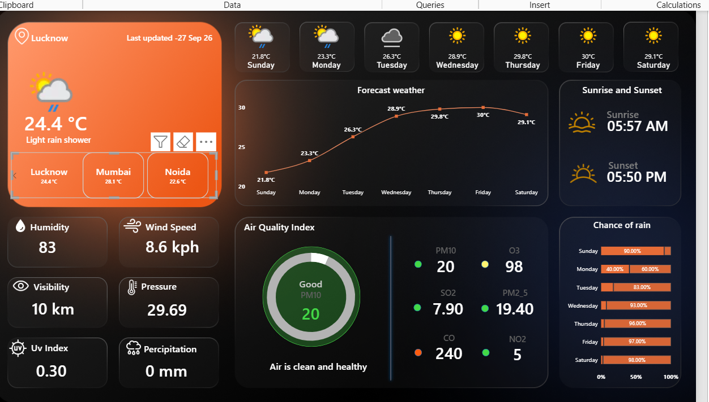

# 🌦️ Weather Analytics Dashboard

An interactive **Weather Analytics Dashboard** built using **Power BI** to monitor and analyze weather conditions, forecasts, air quality, and other important weather indicators.

## 📊 Dashboard Preview

## 🔍 Key Features

- 🌡️ Current temperature and weather condition
- 📅 7-day weather forecast
- 📈 Temperature trend analysis
- 🌧️ Chance of rain by day
- 💧 Humidity monitoring
- 💨 Wind speed analysis
- 👁️ Visibility information
- 🌡️ Atmospheric pressure
- ☀️ UV Index
- 💦 Precipitation tracking
- 🌅 Sunrise and sunset timings
- 🟢 Air Quality Index (AQI)
- 🧪 Analysis of PM10, PM2.5, CO, NO₂, SO₂ and O₃

## 🛠️ Tools & Technologies

- **Power BI**
- **Power Query**
- **DAX**
- **Data Visualization**
- **Data Analysis**

## 📈 Key Insights

The dashboard provides a quick overview of:

- Current weather conditions
- Upcoming temperature changes
- Probability of rainfall
- Air pollution levels
- Daily weather patterns
- Important environmental indicators

## 🎯 Project Objective

The objective of this project is to transform weather data into an **interactive and easy-to-understand dashboard** that helps users quickly analyze weather conditions and environmental factors.
